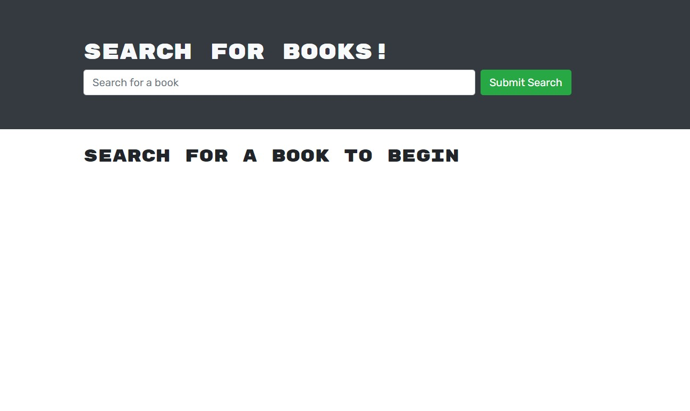
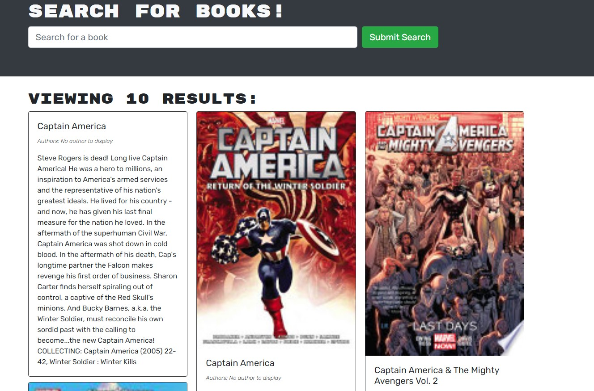
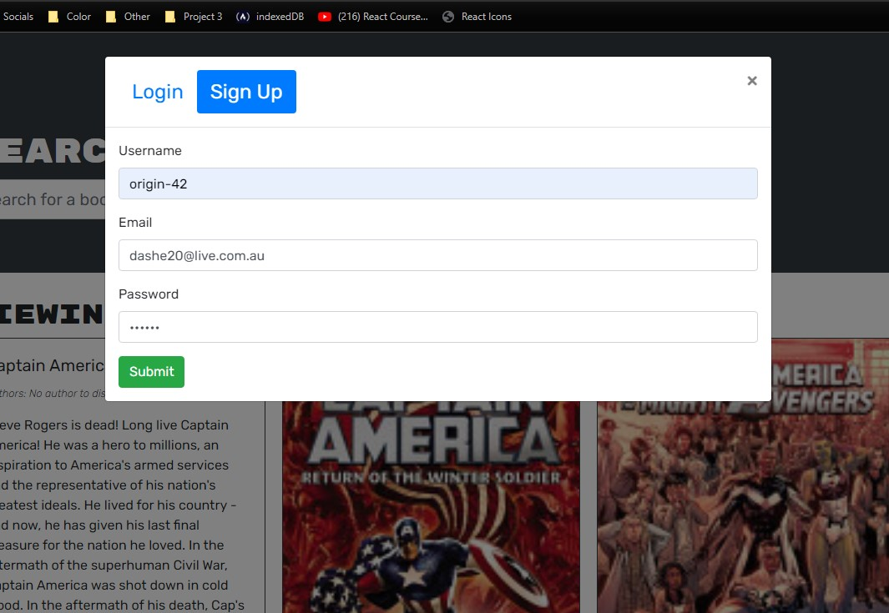
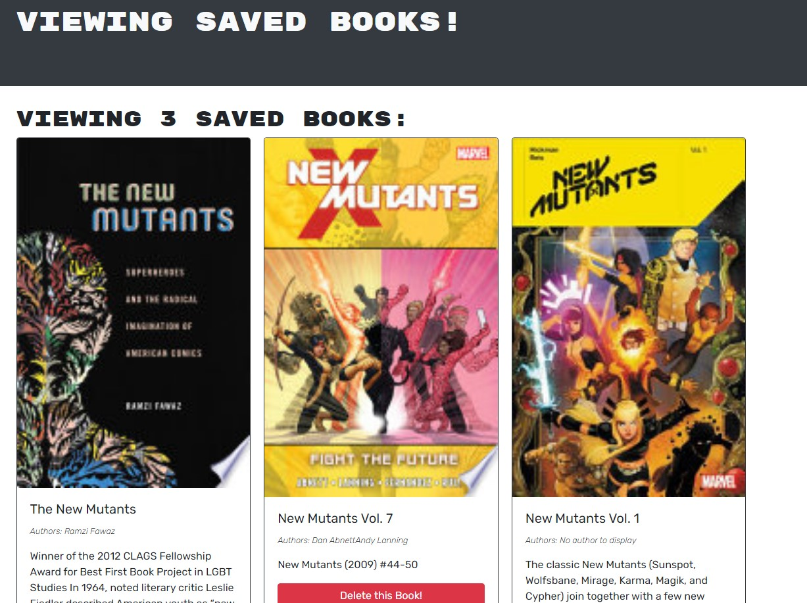

<div align="center">

# Book Search n Save

</div>


<div align="center">

[](https://opensource.org/licenses/MIT) 

</div>


This application is a simple example of the MERN stack with CRUD operations using GraphQL. You can search for books and save them on a per user basis with login/out operations. Handle for book enthusiasts and programmers. 

## Requirements

This application can be run from Heroku (link below), OR,
Download, install, and run the app locally.

## Table of Contents

* [Installation](#installation)
* [Credits](#credits)
* [Questions](#questions)

## Installation

Firstly, Download the application from this github repository by copying the URL from code and copy the following into the designated folder on your directory.
```
git clone {url}
```

Open the application in your text editor.
Configure the application from the root directory.

```
npm i
npm run develop
```

## Credits

[Origin 42](hyperlink): Dave Plummer

## Questions

Direct any questions too;

- [origin-42](https://github.com/origin-42)
- d.plummer89@hotmail.com

## Extras

[Home Page](https://regular-book-store.herokuapp.com/)
[](https://regular-book-store.herokuapp.com/) 
[](https://regular-book-store.herokuapp.com/) 
[](https://regular-book-store.herokuapp.com/) 
[](https://regular-book-store.herokuapp.com/) 
